# Mermaid Graph Examples

Comprehensive collection of graphs, charts, and diagrams using Mermaid syntax.

## Navigation
- [🏠 Back to Main Index](../../index.md)
- [📊 Native Graph Examples](native_graphs.md) - Non-Mermaid graphs
- [👋 Hello World Example](../basic/hello-world.md)
- [🔧 Complex Example](../advanced/complex-example.md)
- [📚 Tutorial 01](../../guides/tutorials/tutorial-01.md)

## Introduction

This document demonstrates various types of graphs, charts, and diagrams that can be embedded in markdown documents. These examples showcase different visualization techniques for documentation, system design, and data presentation.

## Table of Contents
- [Mermaid Diagrams](#mermaid-diagrams)
- [ASCII Art Graphs](#ascii-art-graphs)
- [Mathematical Expressions](#mathematical-expressions)
- [Data Visualization](#data-visualization)

## Mermaid Diagrams

### Flowcharts

#### Basic Flowchart
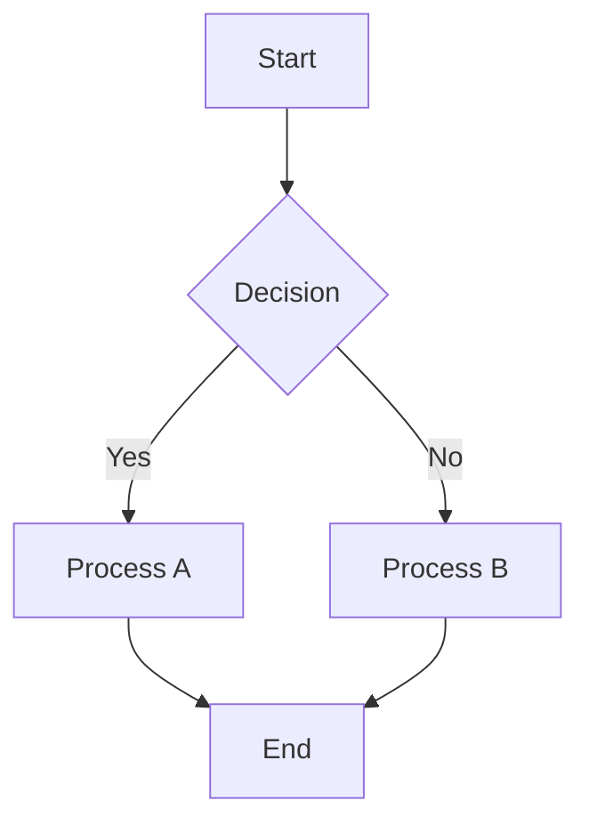

#### Complex System Architecture
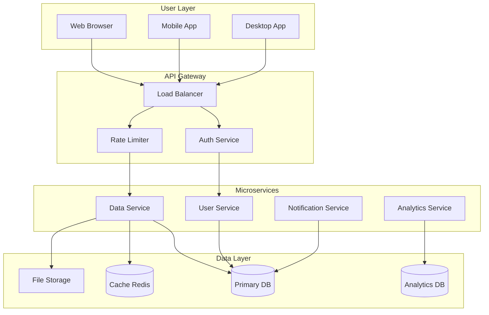

### Sequence Diagrams

#### API Authentication Flow
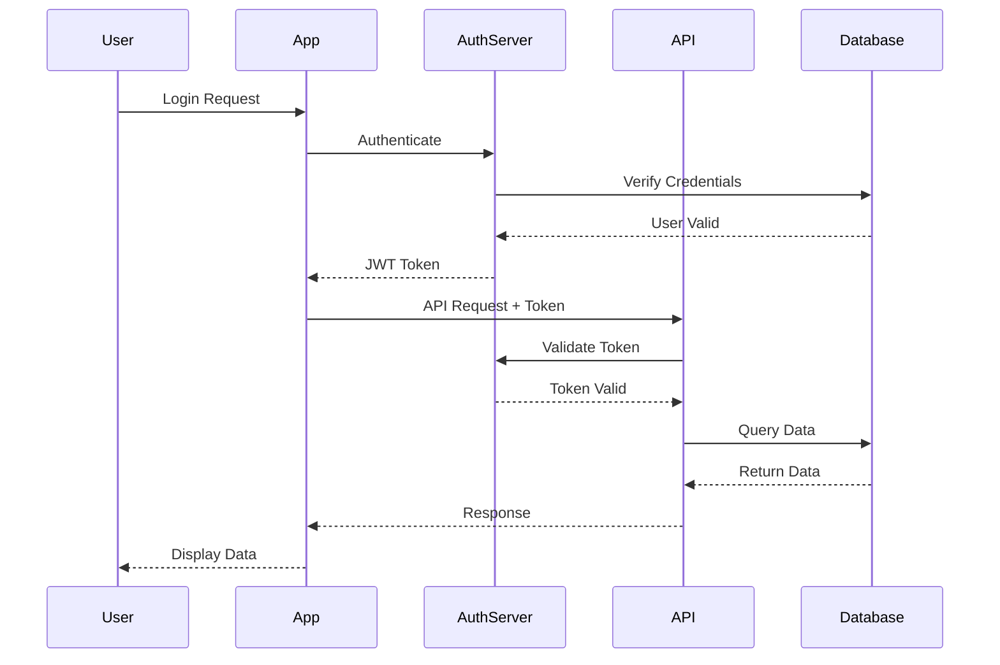

#### Microservices Communication
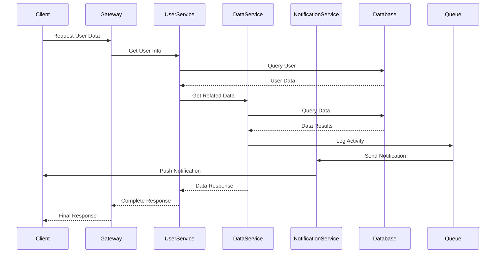

### Class Diagrams

#### Object-Oriented Design
```mermaid
classDiagram
    class User {
        +String id
        +String name
        +String email
        +Date createdAt
        +authenticate()
        +updateProfile()
        +deactivate()
    }
    
    class Document {
        +String id
        +String title
        +String content
        +Date modifiedAt
        +User author
        +save()
        +delete()
        +share()
    }
    
    class Project {
        +String id
        +String name
        +String description
        +User[] members
        +Document[] documents
        +addMember()
        +removeMember()
        +archive()
    }
    
    class Permission {
        +String id
        +String type
        +String resource
        +User user
        +grant()
        +revoke()
    }
    
    User ||--o{ Document : "authors"
    User ||--o{ Project : "member of"
    Project ||--o{ Document : "contains"
    User ||--o{ Permission : "has"
    Document ||--o{ Permission : "protected by"
```

### State Diagrams

#### Document Workflow
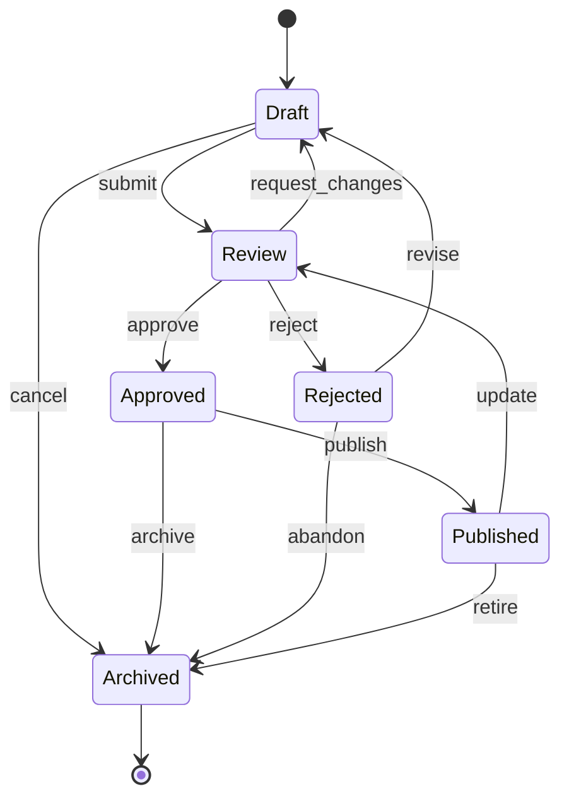

#### User Session Management
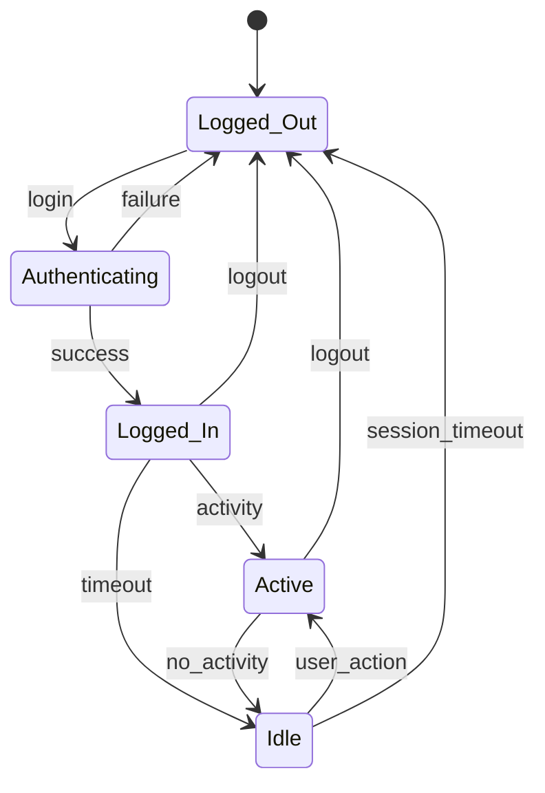

### Entity Relationship Diagrams

#### Database Schema
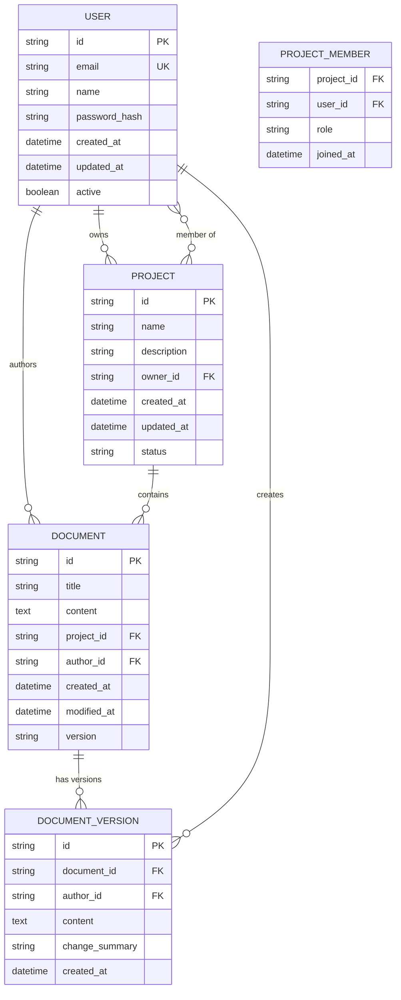

### Gantt Charts

#### Project Timeline
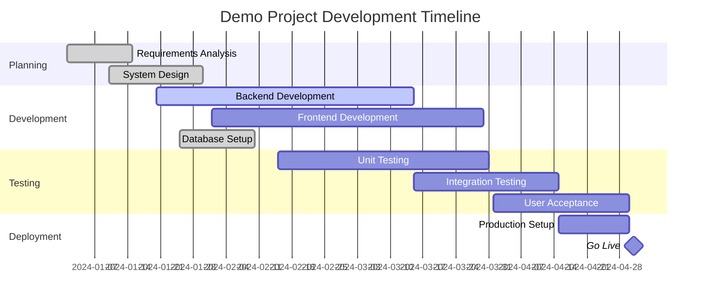

### Pie Charts

#### Resource Allocation
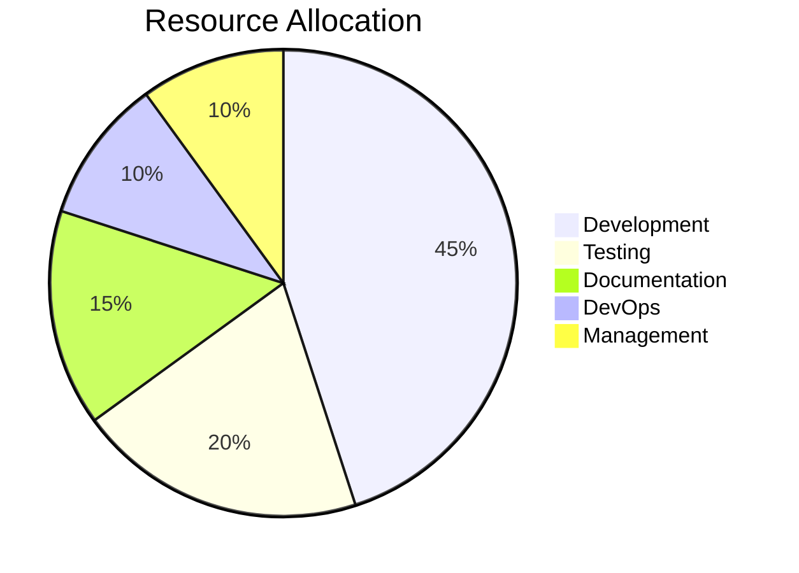

#### Technology Stack Usage
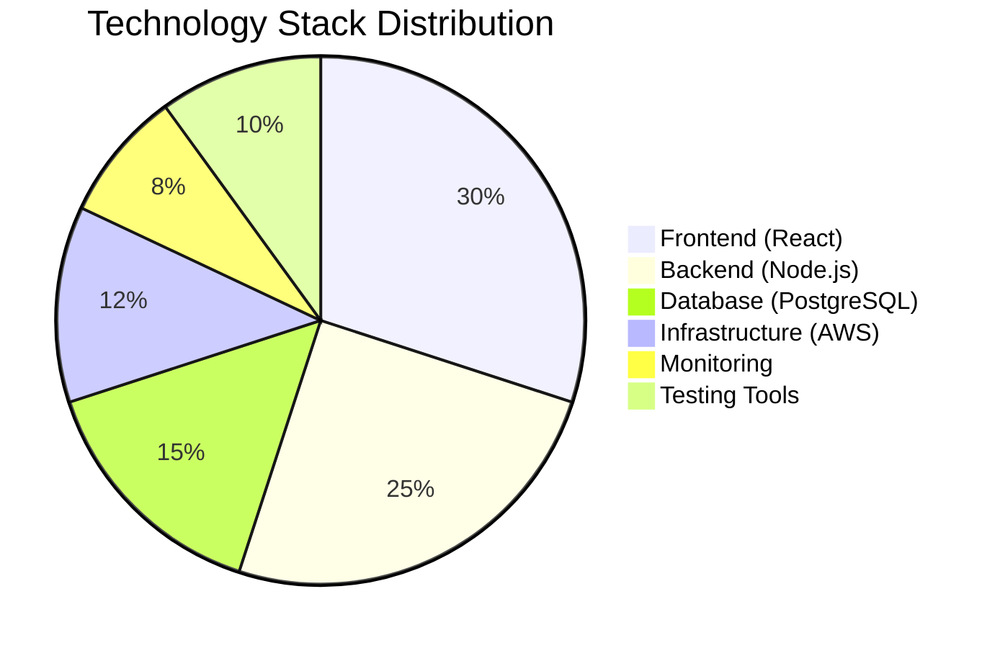

### Git Flow Diagram

#### Development Workflow
```mermaid
gitgraph
    commit id: "Initial"
    branch develop
    checkout develop
    commit id: "Setup"
    branch feature/auth
    checkout feature/auth
    commit id: "Add auth"
    commit id: "Auth tests"
    checkout develop
    merge feature/auth
    branch feature/api
    checkout feature/api
    commit id: "Add API"
    commit id: "API docs"
    checkout develop
    merge feature/api
    checkout main
    merge develop
    commit id: "Release v1.0"
    checkout develop
    commit id: "Hotfix prep"
    checkout main
    commit id: "Hotfix v1.0.1"
```

### User Journey Diagram

#### User Onboarding Experience
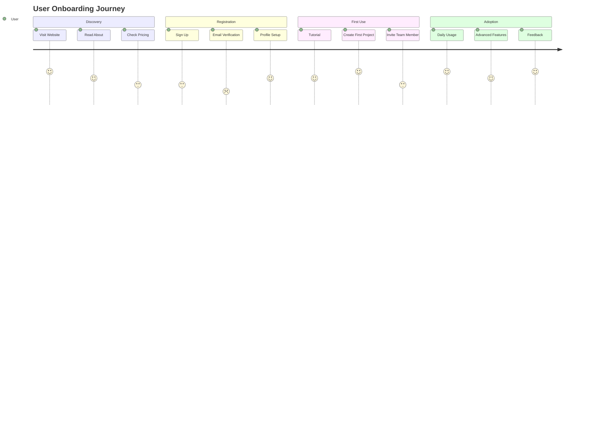

### Requirement Diagrams

#### System Requirements
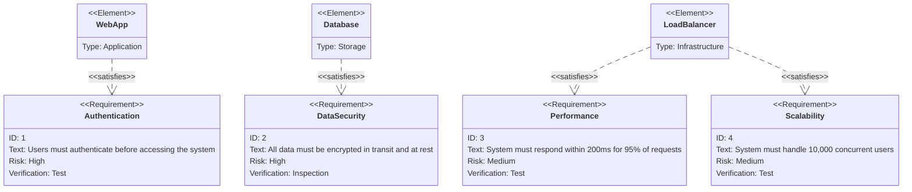

### Mindmap

#### Project Structure Mindmap
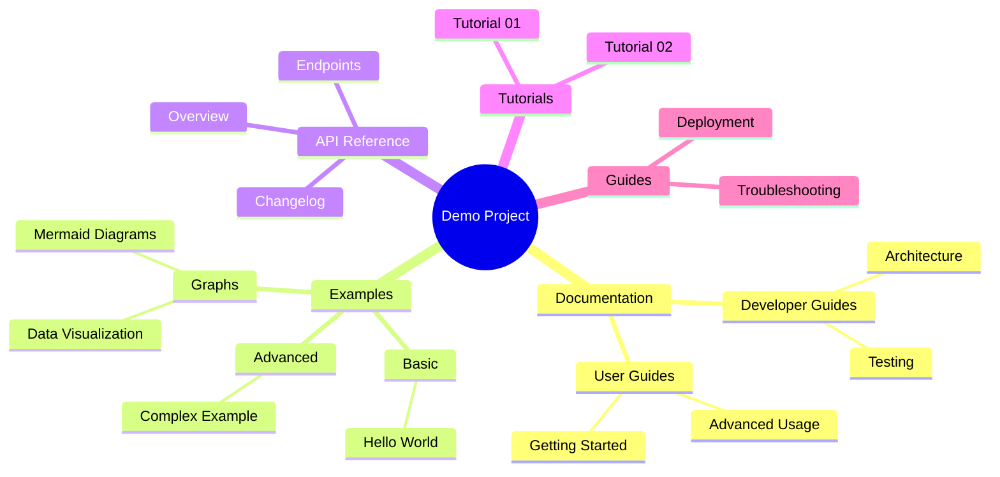

### Quadrant Chart

#### Feature Prioritization
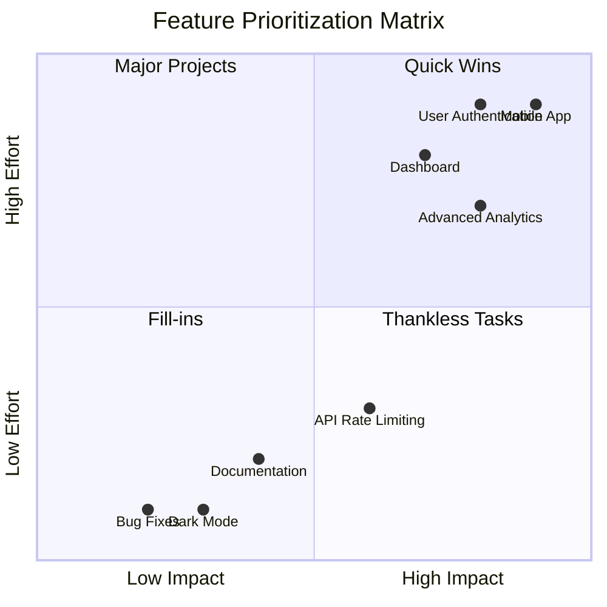

### XY Chart

#### Performance Metrics
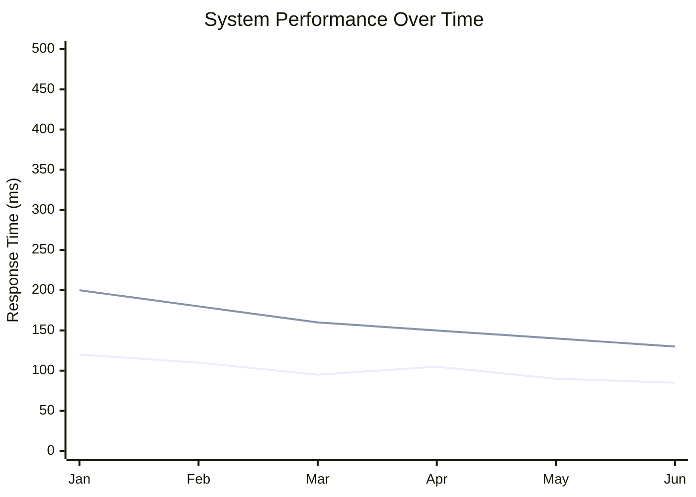

### Timeline

#### Project Milestones
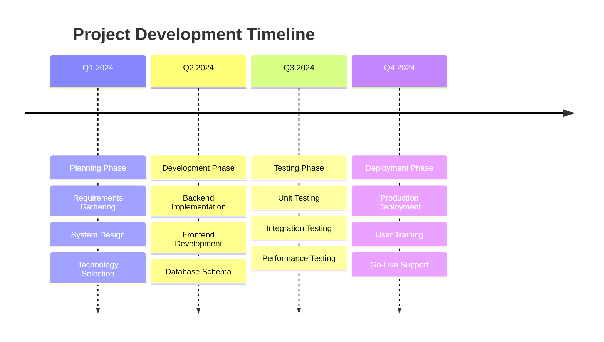

## ASCII Art Graphs

### Simple Bar Chart
```
Project Progress
                              
Backend     ████████████████████ 100%
Frontend    ████████████████     80%
Testing     ██████████           50%
Docs        ████████             40%
Deployment  ██                   10%

0%    25%   50%   75%   100%
```

### Network Topology
```
                    Internet
                        │
                   [Router]
                   /   │   \
                  /    │    \
            [Switch] [Switch] [WiFi AP]
            /   │   \     │      │
           /    │    \    │      │
      [PC1] [PC2] [Server] [PC3] [Mobile]
```

### System Architecture
```
┌─────────────────┐    ┌─────────────────┐    ┌─────────────────┐
│   Load Balancer │────│   Web Server    │────│    Database     │
│                 │    │                 │    │                 │
│   nginx         │    │   Node.js       │    │   PostgreSQL    │
└─────────────────┘    └─────────────────┘    └─────────────────┘
         │                       │                       │
         │                       │                       │
         ▼                       ▼                       ▼
┌─────────────────┐    ┌─────────────────┐    ┌─────────────────┐
│     Cache       │    │   File Storage  │    │   Monitoring    │
│                 │    │                 │    │                 │
│     Redis       │    │      S3         │    │   Prometheus    │
└─────────────────┘    └─────────────────┘    └─────────────────┘
```

## Mathematical Expressions

### Basic Mathematics
```
Linear Function: f(x) = mx + b

Quadratic Formula: x = (-b ± √(b² - 4ac)) / 2a

Exponential Growth: P(t) = P₀ × e^(rt)

Logarithmic Scale: log₁₀(x)
```

### Algorithm Complexity
```
Big O Notation Examples:

O(1)      - Constant Time
O(log n)  - Logarithmic Time
O(n)      - Linear Time
O(n log n)- Linearithmic Time  
O(n²)     - Quadratic Time
O(2ⁿ)     - Exponential Time

Graph: Time Complexity
   │
   │     O(2ⁿ)
   │    ╱
   │   ╱
   │  ╱ O(n²)
   │ ╱╱
   │╱╱ O(n log n)
   ├── O(n)
   ├── O(log n)
   ├── O(1)
   └──────────────── Input Size (n)
```

## Data Visualization

### Table with Trends
| Metric | Q1 | Q2 | Q3 | Q4 | Trend |
|--------|----|----|----|----|-------|
| Users | 1,000 | 2,500 | 4,200 | 6,800 | 📈 |
| Revenue | $10K | $28K | $52K | $85K | 📈 |
| Errors | 45 | 32 | 18 | 12 | 📉 |
| Uptime | 99.1% | 99.5% | 99.8% | 99.9% | 📈 |

### Status Dashboard
```
🟢 API Service: Operational (99.9% uptime)
🟢 Database: Healthy (12ms avg response)
🟡 Cache: Warning (85% memory usage)
🔴 Email Service: Down (investigating)
🟢 File Storage: Operational (99.8% uptime)

Current Load: ████████░░ 80%
```

### Process Flow with Metrics
```
┌─────────┐    ┌─────────┐    ┌─────────┐    ┌─────────┐
│ Request │───▶│ Auth    │───▶│Process  │───▶│Response │
│         │    │         │    │         │    │         │
│1000/sec │    │ 950/sec │    │ 920/sec │    │ 915/sec │
└─────────┘    └─────────┘    └─────────┘    └─────────┘
     ▼              ▼              ▼              ▼
  ┌─────────┐  ┌─────────┐  ┌─────────┐  ┌─────────┐
  │Rate     │  │Auth     │  │Business │  │Success  │
  │Limited  │  │Failed   │  │Logic    │  │Rate     │
  │50/sec   │  │30/sec   │  │Error    │  │91.5%    │
  │         │  │         │  │5/sec    │  │         │
  └─────────┘  └─────────┘  └─────────┘  └─────────┘
```

## Graph Usage in Documentation

### When to Use Different Graph Types

#### Flowcharts
- **Use for**: Process flows, decision trees, algorithm logic
- **Example**: [System architecture](../docs/developer-guide/architecture.md)
- **Best practice**: Keep nodes concise and flows logical

#### Sequence Diagrams  
- **Use for**: API interactions, user workflows, system communications
- **Example**: [Authentication flow](../api/reference/api-overview.md#authentication-methods)
- **Best practice**: Show time progression clearly

#### Class Diagrams
- **Use for**: Object-oriented design, database schemas, system relationships
- **Example**: [Architecture patterns](../docs/developer-guide/architecture.md#design-patterns)
- **Best practice**: Focus on key relationships

#### State Diagrams
- **Use for**: Workflow states, user journeys, system states
- **Example**: [Testing procedures](../docs/developer-guide/testing.md#test-categories)
- **Best practice**: Define clear state transitions

#### Gantt Charts
- **Use for**: Project timelines, milestone tracking, resource planning
- **Example**: [Deployment planning](../guides/how-to/deployment.md#deployment-procedures)
- **Best practice**: Include dependencies and critical path

## Integration with Project Documentation

### Cross-References to Other Documents
These graph examples complement the project documentation:

- **Architecture diagrams** support [system design documentation](../docs/developer-guide/architecture.md)
- **Sequence diagrams** enhance [API documentation](../api/reference/api-overview.md)
- **Flowcharts** clarify [user guides](../docs/user-guide/getting-started.md)
- **State diagrams** illustrate [testing workflows](../docs/developer-guide/testing.md)

### Best Practices for Graph Integration

1. **Consistency**: Use similar styling across all diagrams
2. **Context**: Provide explanatory text before and after graphs
3. **Updates**: Keep graphs synchronized with code/system changes
4. **Accessibility**: Include alt text and descriptions
5. **Performance**: Consider diagram complexity and rendering time

## Testing Graph Rendering

To test these graphs:
1. **Open this file** in MD Tool
2. **Verify Mermaid rendering** - all diagrams should display properly
3. **Check ASCII art** - should maintain formatting
4. **Test navigation links** - all cross-references should work
5. **Review in different themes** - ensure readability in dark/light modes

## Related Documentation

### Examples
- [Hello World Example](basic/hello-world.md) - Simple markdown usage
- [Complex Example](advanced/complex-example.md) - Advanced navigation patterns

### User Guides  
- [Getting Started](../docs/user-guide/getting-started.md) - Basic concepts
- [Advanced Usage](../docs/user-guide/advanced-usage.md) - Power features

### Developer Resources
- [Architecture Overview](../docs/developer-guide/architecture.md) - System design
- [Testing Guide](../docs/developer-guide/testing.md) - Validation procedures

### API Documentation
- [API Overview](../api/reference/api-overview.md) - Complete API guide
- [API Endpoints](../api/reference/endpoints.md) - Endpoint reference

---

*Return to [Main Index](../../index.md) or [Native Graph Examples](native_graphs.md) for complete project navigation.*