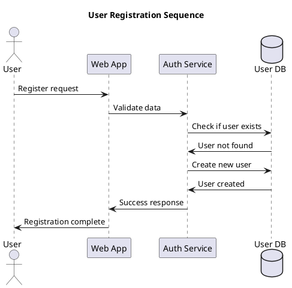
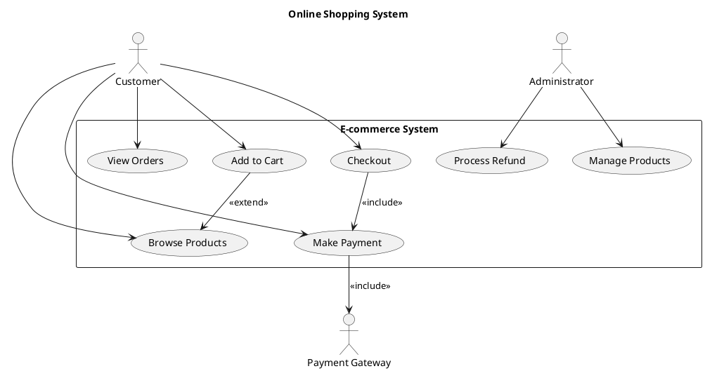
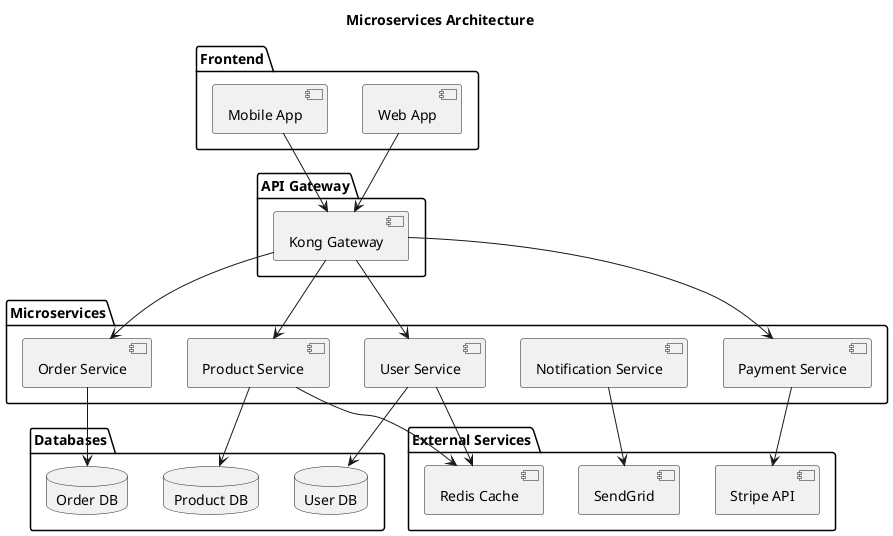
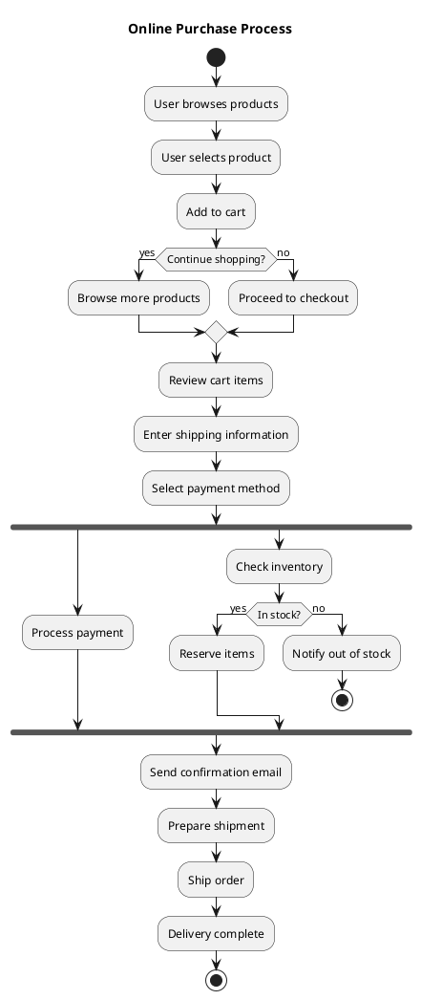

# Graph Examples

This document demonstrates all supported graph types in MDTool (excluding Mermaid).

## Statistical Charts

### Bar Chart Example

```chart
type: bar
title: Monthly Sales Report
description: Sales data for Q1 2024
data:
January: 15000
February: 18000
March: 22000
April: 19500
May: 24000
```

### Line Chart Example

```linechart
type: line
title: Website Traffic Trends
description: Daily visitors over time
data:
0,120
1,135
2,128
3,142
4,158
5,163
6,171
7,166
8,178
9,185
10,192
```

### Pie Chart Example

```piechart
type: pie
title: Budget Distribution
description: Annual budget allocation by department
data:
Engineering: 35
Marketing: 25
Sales: 20
Support: 15
HR: 5
```

### Scatter Chart Example

```scatterchart
type: scatter
title: Performance vs Experience
description: Employee performance correlation
data:
1,65,Junior
2,72,Junior
3,78,Mid-level
4,82,Mid-level
5,88,Senior
6,91,Senior
7,94,Senior
8,85,Mid-level
```

### Area Chart Example

```areachart
type: area
title: Revenue Growth
description: Monthly revenue accumulation
data:
0,10000
1,12000
2,15000
3,18000
4,22000
5,26000
6,31000
7,35000
8,40000
9,44000
10,48000
11,52000
```

## Flowchart Diagrams

### Basic Process Flow

```flowchart
title: Order Processing Flow
(start) Start Process
[validate] Validate Order
{check_inventory} Check Inventory Available?
[process_payment] Process Payment
[ship_order] Ship Order
[update_inventory] Update Inventory
(end) Order Complete

start -> validate
validate -> check_inventory
check_inventory -> process_payment Yes
check_inventory -> update_inventory No
process_payment -> ship_order
ship_order -> end
update_inventory -> end
```

### Decision Tree Example

```flow
title: User Authentication Flow
(start) User Login
[validate_creds] Validate Credentials
{valid_user} Valid User?
{has_2fa} Has 2FA Enabled?
[send_2fa] Send 2FA Code
[verify_2fa] Verify 2FA
[grant_access] Grant Access
[deny_access] Deny Access
(end) End Process

start -> validate_creds
validate_creds -> valid_user
valid_user -> has_2fa Yes
valid_user -> deny_access No
has_2fa -> send_2fa Yes
has_2fa -> grant_access No
send_2fa -> verify_2fa
verify_2fa -> grant_access
deny_access -> end
grant_access -> end
```

## Git Flow Diagrams

### Feature Branch Workflow

```gitgraph
title: Feature Development Workflow
branch main
commit Initial commit
commit Add core features
branch feature/user-auth
commit Add login form
commit Implement authentication
commit Add password validation
checkout main
commit Fix critical bug
checkout feature/user-auth
commit Update tests
merge feature/user-auth
commit Deploy to production
```

### Complex Git Flow

```git
title: Multi-branch Development
branch main
branch develop
branch feature/api
branch hotfix/security

commit Setup project
checkout develop
commit Add development framework
checkout feature/api
commit API endpoints
commit API documentation
commit API tests
checkout develop
merge feature/api
checkout main
commit Production release v1.0
checkout hotfix/security
commit Security patch
checkout main
merge hotfix/security
commit Hotfix release v1.0.1
```

## PlantUML Diagrams

### Sequence Diagram



### Class Diagram

```uml
@startuml
title E-commerce Domain Model

class User {
  -id: UUID
  -email: String
  -password: String
  +login(): boolean
  +logout(): void
}

class Product {
  -id: UUID
  -name: String
  -price: Money
  -stock: int
  +updatePrice(price: Money): void
  +reduceStock(quantity: int): void
}

class Order {
  -id: UUID
  -userId: UUID
  -status: OrderStatus
  -items: List<OrderItem>
  +addItem(item: OrderItem): void
  +calculateTotal(): Money
}

class OrderItem {
  -productId: UUID
  -quantity: int
  -unitPrice: Money
}

enum OrderStatus {
  PENDING
  CONFIRMED
  SHIPPED
  DELIVERED
  CANCELLED
}

User ||--o{ Order
Order ||--o{ OrderItem
OrderItem }o--|| Product
Order ||--|| OrderStatus
@enduml
```

### Use Case Diagram



### Component Diagram



### Activity Diagram


