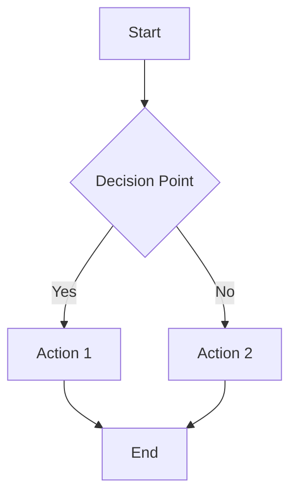
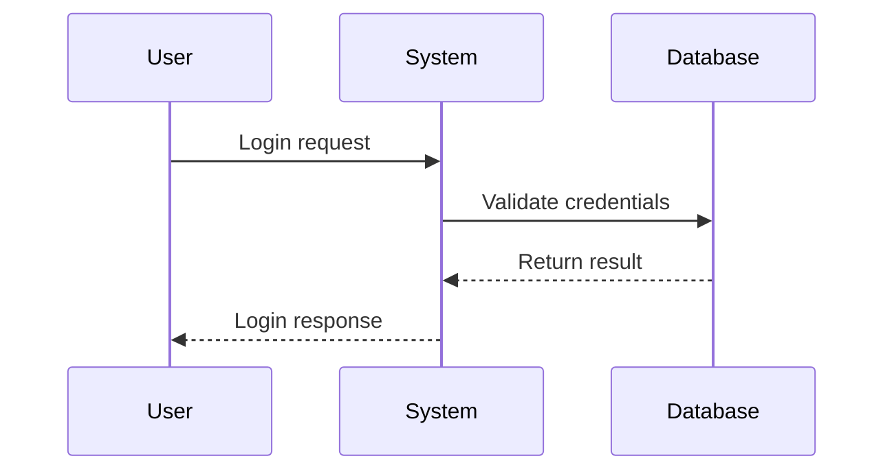
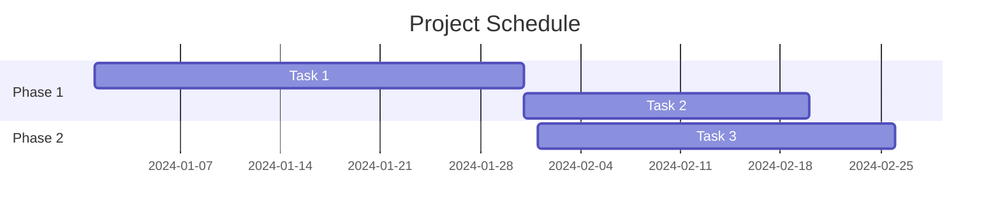
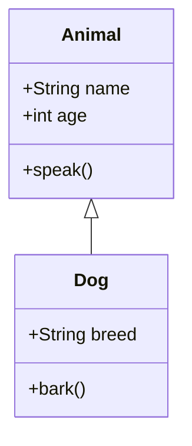

# Advanced Features

MDTool offers powerful advanced features that extend beyond basic Markdown editing. This guide covers AI integration, PDF export, diff comparison, visualization tools, and multi-window workflows.

## AI Integration

MDTool integrates with both OpenAI and Ollama to provide intelligent document assistance, making it a powerful tool for enhanced writing and analysis.

### Supported AI Services

#### OpenAI Integration
- **Models supported**: GPT-4, GPT-3.5, and other OpenAI models
- **API key required**: Set up through Preferences → AI Settings
- **Usage tracking**: Monitor token usage and costs
- **Rate limiting**: Automatic handling of API rate limits

#### Ollama Integration  
- **Local AI models**: Run AI models locally on your machine
- **Privacy focused**: No data sent to external services
- **Model selection**: Choose from various open-source models
- **Custom models**: Support for custom fine-tuned models

### AI Chat Features

#### Document Chat
**Chat about current document:**
1. Click "Chat" button in toolbar or use Cmd/Ctrl + K
2. AI has full context of your current document
3. Ask questions about content, request improvements, or get suggestions
4. Chat history maintained per document

**Example interactions:**
- "Summarize the main points in this document"
- "Improve the clarity of the third paragraph"
- "Generate an outline for this content"
- "Check for inconsistencies in my arguments"

#### Folder Chat
**Chat about folder contents:**
1. Right-click any folder in sidebar
2. Select "Chat About Folder"
3. AI analyzes all Markdown files in the folder
4. Get insights across multiple documents

**Use cases:**
- Project overview and status
- Content consistency across documents
- Cross-document fact checking
- Research synthesis

### Context Strategies

MDTool uses intelligent context strategies to provide relevant AI assistance:

#### Progressive Context Strategy
- **Smart selection**: Automatically selects relevant document portions
- **Context optimization**: Balances detail with token efficiency
- **Dynamic adjustment**: Adapts context based on document length and complexity

#### Enhanced Progressive Context Strategy  
- **Multi-document awareness**: Considers related documents in folder
- **Semantic chunking**: Breaks content into meaningful sections
- **Priority weighting**: Important sections get higher priority

#### Configuration
Access context strategy settings:
1. Preferences → AI Settings → Context Strategy
2. Choose strategy based on your needs
3. Adjust parameters for optimal performance

### AI Analytics

#### Usage Tracking
Monitor your AI usage through the analytics dialog:
- **Token consumption**: Track tokens used per service
- **Cost estimation**: Estimated costs for OpenAI usage
- **Usage patterns**: See when and how you use AI features
- **Performance metrics**: Response times and success rates

#### Usage Limits
- **Set spending limits**: Control OpenAI costs
- **Daily/monthly caps**: Prevent unexpected charges
- **Warning thresholds**: Get alerts when approaching limits
- **Usage reports**: Detailed breakdowns of AI usage

## PDF Export

Transform your Markdown documents into professional PDF files with advanced formatting and customization options.

### Export Process
1. **Open document** you want to export
2. **Click Export PDF** in toolbar or use Tools → Export PDF
3. **Configure settings** in export dialog
4. **Choose output location** and filename
5. **Click Export** to generate PDF

### Export Options

#### Page Setup
- **Page size**: A4, Letter, Legal, or custom dimensions
- **Orientation**: Portrait or landscape
- **Margins**: Adjustable margins (top, bottom, left, right)
- **Headers/Footers**: Optional headers and footers with page numbers

#### Formatting
- **Font selection**: Choose fonts for different elements
- **Font sizes**: Customize heading and body text sizes  
- **Line spacing**: Adjust line height for readability
- **Color scheme**: Maintain or modify colors from preview

#### Content Options
- **Include table of contents**: Auto-generate TOC from headings
- **Page breaks**: Control where pages break
- **Code block formatting**: Syntax highlighting in PDF
- **Image handling**: Embed images with quality settings

### Advanced PDF Features

#### Professional Styling
- **Corporate themes**: Professional document templates
- **Custom CSS**: Advanced users can inject custom CSS
- **Watermarks**: Add text or image watermarks
- **Cover pages**: Generate professional cover pages

#### Metadata
- **Document properties**: Title, author, subject, keywords
- **Creation info**: Automatically include creation date
- **Security options**: Password protection and permissions
- **PDF/A compliance**: Generate archival-quality PDFs

## Diff Comparison

Compare different versions of documents or analyze changes between files using MDTool's powerful diff viewer.

### Comparison Types

#### File vs File
- **Select two files**: Choose any two Markdown files for comparison
- **Cross-folder comparison**: Compare files from different folders
- **Side-by-side view**: See differences highlighted side-by-side
- **Unified view**: Show changes in single pane with markup

#### Version Comparison
- **Before/After**: Compare original with modified version
- **Git integration**: Compare with committed versions (if in git repository)
- **Backup comparison**: Compare with auto-saved versions
- **Time-based**: Compare versions from different time periods

### Diff Viewer Features

#### Visual Indicators
- **Added content**: Green highlighting for new content
- **Removed content**: Red highlighting for deleted content  
- **Modified content**: Yellow/orange highlighting for changes
- **Line numbers**: Synchronized line numbering

#### Navigation
- **Jump to changes**: Quick navigation between differences
- **Change summary**: Overview of all changes found
- **Search within diff**: Find specific changes
- **Export diff**: Save comparison results

#### Advanced Analysis
- **Word-level diff**: See changes within paragraphs
- **Ignore whitespace**: Option to ignore spacing changes
- **Case sensitivity**: Choose whether case matters
- **Structural analysis**: Understand document structure changes

## Graph and Diagram Visualization

MDTool provides advanced support for creating and rendering various types of diagrams and visualizations.

### Mermaid Diagrams

#### Flowcharts
Create process flows and decision trees:
````markdown

````

#### Sequence Diagrams
Show interactions between entities:
````markdown

````

#### Gantt Charts
Project timeline visualization:
````markdown

````

#### Class Diagrams
Software architecture visualization:
````markdown

````

### Chart Integration

#### Data Charts
Create charts from data within your documents:
````markdown
```chart
{
  "type": "bar",
  "data": {
    "labels": ["Jan", "Feb", "Mar", "Apr"],
    "datasets": [{
      "label": "Sales",
      "data": [65, 59, 80, 81]
    }]
  }
}
```
````

#### Interactive Charts
- **Hover effects**: Interactive data points
- **Zoom and pan**: Navigate large datasets
- **Export options**: Save charts as images
- **Real-time updates**: Charts update as data changes

### Performance Optimization

#### Mermaid Rendering
- **Lazy loading**: Diagrams render when visible
- **Caching**: Rendered diagrams cached for performance
- **Background processing**: Complex diagrams processed in background
- **Error handling**: Graceful handling of syntax errors

## Multi-Window Support

Work with multiple documents simultaneously using MDTool's flexible window management system.

### Window Management

#### Creating New Windows
- **File → New Window**: Create additional MDTool window
- **Detach tabs**: Drag tabs out to create new windows
- **Context menu**: Right-click tab → "Move to New Window"
- **Keyboard shortcut**: Cmd/Ctrl + Shift + N

#### Window Arrangement
- **Side-by-side**: Arrange windows for comparison
- **Multiple monitors**: Spread windows across displays
- **Floating windows**: Keep references visible while working
- **Window switching**: Cmd/Ctrl + ` to switch between windows

### Detached Chat Windows

#### Chat Window Features
- **Persistent chat**: Chat windows remain open independently
- **Context awareness**: Maintain context with source document
- **Multi-document chat**: Chat about multiple open documents
- **Window positioning**: Position chat alongside documents

#### Use Cases
- **Reference while writing**: Keep research chat open while drafting
- **Document analysis**: Analyze one document while editing another
- **Collaboration**: Share screen with chat visible
- **Multi-tasking**: Work on multiple projects simultaneously

### Synchronized Workflows

#### Content Synchronization
- **Shared clipboard**: Copy/paste between windows
- **Cross-window search**: Search across all open documents
- **Unified recent files**: Recent files shared across windows
- **Preference sync**: Settings apply to all windows

#### Workspace Management
- **Window sessions**: Save and restore window arrangements
- **Project workspaces**: Different window setups for different projects
- **Quick switching**: Fast switching between workspace configurations

## Performance Monitoring

Track and optimize MDTool's performance with built-in monitoring tools.

### Performance Metrics

#### Real-time Monitoring
Access performance data through:
1. Status bar → Click metrics icon
2. Tools → Performance Metrics
3. View real-time performance data

**Key metrics:**
- **Memory usage**: RAM consumption by MDTool
- **CPU usage**: Processing load
- **Render times**: How fast content renders
- **File operation times**: Speed of file operations

#### Performance Analysis
- **Bottleneck identification**: Find performance issues
- **Resource usage trends**: Monitor usage over time
- **Optimization suggestions**: Automatic recommendations
- **Benchmark comparisons**: Compare with baseline performance

### Optimization Features

#### Automatic Optimization
- **Memory management**: Automatic garbage collection
- **Lazy loading**: Load content only when needed
- **Cache management**: Intelligent caching of frequently used data
- **Background processing**: Heavy operations run in background

#### Manual Optimization
- **Clear caches**: Manual cache clearing options
- **Reduce memory usage**: Tips for reducing memory footprint
- **Performance mode**: Simplified interface for better performance
- **Resource limits**: Set limits on resource usage

## Integration with External Tools

### Command Line Integration
- **CLI commands**: Open files from command line
- **Shell integration**: Work with shell scripts and automation
- **Batch operations**: Process multiple files programmatically
- **API access**: Programmatic access to MDTool features (future feature)

### Development Tools
- **Git integration**: Works seamlessly with version control
- **IDE compatibility**: Use alongside development environments
- **Build system integration**: Include in documentation build processes
- **CI/CD integration**: Automated documentation workflows

### Third-Party Services
- **Cloud storage**: Sync with Dropbox, OneDrive, Google Drive
- **Note-taking apps**: Import/export with other note-taking tools
- **Documentation systems**: Export to wikis and documentation platforms
- **Publishing platforms**: Prepare content for blogs and publishing

## Tips for Advanced Usage

### AI Best Practices
1. **Start with specific questions**: Ask precise questions for better responses
2. **Provide context**: Include relevant background information
3. **Iterate on responses**: Refine questions based on initial answers
4. **Monitor usage**: Keep track of token consumption and costs

### Workflow Optimization
1. **Use templates**: Create templates for common document types
2. **Leverage multi-window**: Keep reference materials open in separate windows
3. **Organize by project**: Use folder structure to organize related documents
4. **Automate exports**: Use PDF export settings templates for consistency

### Performance Tips
1. **Close unused windows**: Reduce memory usage by closing unnecessary windows
2. **Limit simultaneous diagrams**: Avoid too many complex diagrams in one document
3. **Use progressive context**: Choose appropriate AI context strategy for your needs
4. **Monitor metrics**: Regularly check performance metrics for optimization opportunities