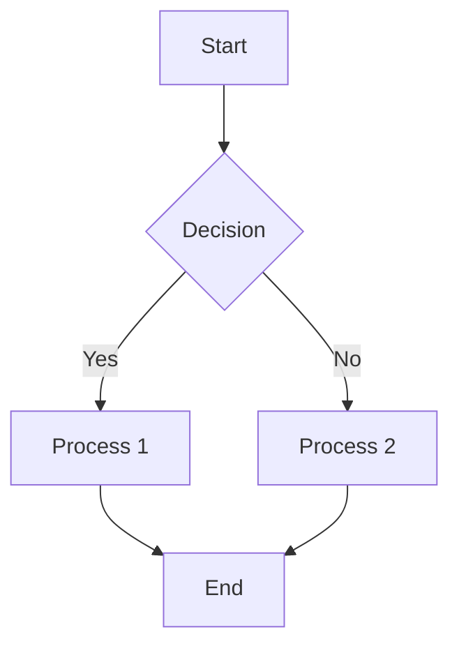
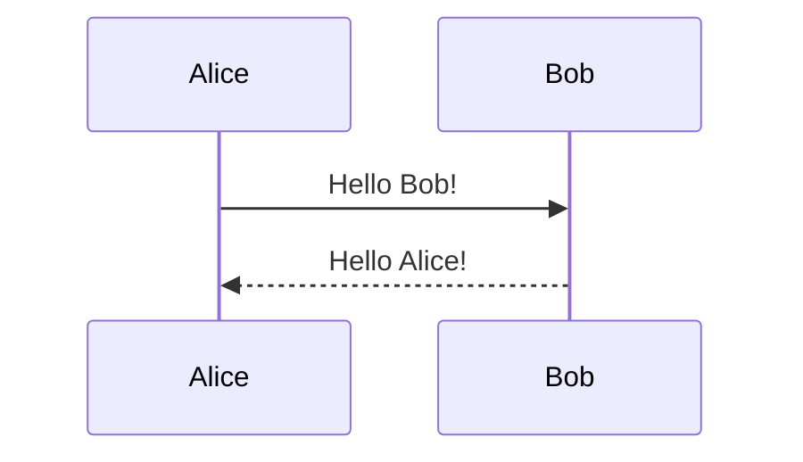
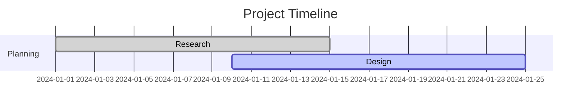

# Editing Features

MDTool provides a powerful and intuitive editing experience with advanced Markdown support, real-time preview, and professional writing tools. This guide covers all editing capabilities to help you write efficiently and effectively.

## Editor Overview

### Code Editor Features
MDTool uses a professional code editor with:
- **Syntax highlighting**: Markdown elements are color-coded
- **Smart indentation**: Automatic indentation for lists and code blocks
- **Line numbers**: Optional line numbering (toggle in preferences)
- **Word wrap**: Text wraps at window boundary
- **Multiple cursors**: Edit in multiple places simultaneously
- **Bracket matching**: Automatic bracket and quote pairing

### Live Preview
- **Real-time rendering**: See changes immediately in preview mode
- **Split view**: Edit and preview simultaneously
- **Scroll synchronization**: Optional synchronized scrolling between editor and preview
- **Quick toggle**: Switch between edit and preview modes instantly

## Markdown Syntax Support

### Basic Formatting
MDTool supports all standard Markdown syntax with enhanced rendering:

```markdown
# Heading 1
## Heading 2
### Heading 3

**Bold text** and *italic text*
***Bold and italic***
~~Strikethrough~~
`inline code`

> Blockquote text
> Multi-line blockquotes
>> Nested blockquotes
```

### Lists and Tasks
```markdown
- Unordered list item
- Another item
  - Nested item
  - Another nested item

1. Ordered list item
2. Another numbered item
   1. Nested numbered item
   2. Another nested item

- [ ] Unchecked task
- [x] Completed task
- [ ] Another task
  - [x] Nested completed task
```

### Links and Images
```markdown
[Link text](https://example.com)
[Link with title](https://example.com "Link title")


Reference-style links:
[Link text][reference]
[reference]: https://example.com
```

### Tables
```markdown
| Column 1 | Column 2 | Column 3 |
|----------|----------|----------|
| Data 1   | Data 2   | Data 3   |
| More     | Data     | Here     |

Left-aligned | Center-aligned | Right-aligned
:------------|:--------------:|--------------:
Left         | Center         | Right
```

### Code Blocks
````markdown
```javascript
function hello() {
    console.log("Hello, World!");
}
```

```python
def hello_world():
    print("Hello, World!")
```

```bash
echo "Hello, World!"
```
````

## Advanced Markdown Features

### Math Equations
MDTool supports LaTeX-style math notation:

```markdown
Inline math: $E = mc^2$

Block math:
$$
\sum_{i=1}^{n} x_i = x_1 + x_2 + \cdots + x_n
$$
```

### Diagrams and Charts
Create visual diagrams directly in Markdown using Mermaid syntax:

#### Flowcharts
````markdown

````

#### Sequence Diagrams
````markdown

````

#### Gantt Charts
````markdown

````

### Enhanced Code Blocks
MDTool supports enhanced code blocks with additional features:

````markdown
```javascript {line-numbers}
// Code with line numbers
function calculateSum(a, b) {
    return a + b;
}
```

```python {highlight-lines: "2-3"}
def example():
    # These lines are highlighted
    x = 10
    y = 20
    return x + y
```
````

## Text Editing Tools

### Find and Replace
**Basic Find** (Cmd/Ctrl + F):
- **Case sensitive**: Toggle case-sensitive search
- **Whole words**: Match complete words only
- **Regular expressions**: Use regex patterns for complex searches
- **Navigate results**: Jump between matches

**Find and Replace** (Cmd/Ctrl + H):
- **Replace single**: Replace current match
- **Replace all**: Replace all matches at once
- **Preview changes**: See what will be replaced
- **Undo replacements**: Reverse replacements if needed

### Multi-Cursor Editing
- **Add cursor**: Alt/Option + Click to add additional cursors
- **Select next occurrence**: Cmd/Ctrl + D to select next instance of current word
- **Select all occurrences**: Cmd/Ctrl + Shift + L to select all instances
- **Column selection**: Alt/Option + Shift + drag for column selection

### Text Manipulation
**Quick formatting shortcuts**:
- **Bold**: Cmd/Ctrl + B - Wrap selection in `**bold**`
- **Italic**: Cmd/Ctrl + I - Wrap selection in `*italic*`
- **Code**: Cmd/Ctrl + ` - Wrap selection in `` `code` ``
- **Link**: Cmd/Ctrl + K - Create link from selection
- **Quote**: Cmd/Ctrl + Q - Create blockquote

**Smart text features**:
- **Auto-pairing**: Automatic closing of brackets, quotes, and parentheses
- **Smart indentation**: Context-aware indentation for lists and code
- **Auto-completion**: Suggestions for Markdown syntax and common words
- **Spell check**: Built-in spell checking with suggestions

## Auto-Save and Version Control

### Auto-Save Behavior
MDTool automatically saves your work to prevent data loss:
- **Automatic saving**: Saves every 30 seconds (configurable)
- **Change detection**: Only saves when document has been modified
- **Save status**: Status bar shows "Saved", "Saving...", or "Modified"
- **Recovery**: Automatic recovery of unsaved changes after crashes

### Manual Save Options
- **Save**: Cmd/Ctrl + S - Save current document
- **Save As**: Cmd/Ctrl + Shift + S - Save with new name or location
- **Save All**: Save all open documents
- **Auto-save toggle**: Enable/disable auto-save in preferences

### Document History
- **Undo/Redo**: Unlimited undo/redo history (Cmd/Ctrl + Z, Cmd/Ctrl + Y)
- **Change tracking**: Visual indicators for recently modified text
- **Version comparison**: Compare different versions using the diff tool

## Formatting Assistance

### Smart Lists
- **Auto-continuation**: Press Enter in a list to create the next item
- **Smart indentation**: Tab and Shift+Tab to indent/outdent list items
- **List conversion**: Convert between ordered and unordered lists
- **Task completion**: Click checkboxes in preview mode to toggle completion

### Table Editing
- **Table creation**: Use toolbar button or type table syntax
- **Column alignment**: Set left, center, or right alignment
- **Auto-formatting**: Tables are automatically formatted for readability
- **Navigation**: Tab to move between cells, Shift+Tab to move backward

### Heading Management
- **Outline navigation**: Quick jump to headings using document outline
- **Heading levels**: Easy promotion/demotion of heading levels
- **Table of contents**: Auto-generate TOC from headings
- **Heading completion**: Auto-suggest heading text based on document content

## Writing Assistance

### Word Count and Statistics
Real-time document statistics in status bar:
- **Word count**: Total words in document
- **Character count**: Total characters with/without spaces
- **Line count**: Total lines in document
- **Reading time**: Estimated reading time
- **Page count**: Estimated pages (for PDF export)

### Focus Mode
Distraction-free writing environment:
- **Hide sidebar**: Remove file browser for focus
- **Full screen**: Use entire screen for writing
- **Typewriter mode**: Keep current line in center of screen
- **Highlight current paragraph**: Dim other paragraphs

### Writing Goals
- **Word count targets**: Set daily or document word count goals
- **Progress tracking**: Visual progress indicators
- **Time tracking**: Track writing time and productivity
- **Session statistics**: Statistics for current writing session

## Document Navigation

### Quick Navigation
- **Go to line**: Cmd/Ctrl + G - Jump to specific line number
- **Go to heading**: Cmd/Ctrl + Shift + O - Navigate to headings
- **Breadcrumb navigation**: Navigate through document structure
- **Minimap**: Optional minimap for long documents

### Document Outline
- **Hierarchical view**: Tree view of document headings
- **Click to navigate**: Jump to any heading instantly
- **Collapsible sections**: Expand/collapse outline sections
- **Current position**: Highlight current location in outline

### Bookmarks
- **Add bookmarks**: Mark important locations in document
- **Bookmark navigation**: Quick jump between bookmarked locations
- **Bookmark list**: View all bookmarks in current document
- **Persistent bookmarks**: Bookmarks saved with document

## Performance and Optimization

### Large Document Handling
- **Lazy loading**: Only render visible portions of very large documents
- **Syntax highlighting limits**: Reasonable limits for performance
- **Smooth scrolling**: Optimized scrolling for large files
- **Memory management**: Efficient memory usage for multiple documents

### Real-Time Performance
- **Instant preview**: Sub-100ms preview updates
- **Typing responsiveness**: No lag during fast typing
- **Smooth animations**: Fluid interface animations
- **Background processing**: Heavy operations don't block UI

## Customization Options

### Editor Preferences
Available in Preferences > Editor:
- **Font family**: Choose your preferred editing font
- **Font size**: Adjust text size for comfort
- **Line height**: Control line spacing
- **Tab size**: Set tab width (2, 4, or 8 spaces)
- **Word wrap**: Enable/disable word wrapping
- **Line numbers**: Show/hide line numbers
- **Whitespace**: Show/hide invisible characters

### Theme Customization
- **Light/Dark themes**: System preference or manual selection
- **Syntax highlighting**: Customize color schemes for Markdown elements
- **Preview themes**: Different themes for preview mode
- **Custom CSS**: Advanced users can customize preview styling

### Keyboard Shortcuts
- **Customizable shortcuts**: Modify any keyboard shortcut
- **Import/Export**: Share shortcut configurations
- **Context-sensitive**: Different shortcuts for different modes
- **Conflict detection**: Automatic detection of shortcut conflicts

## Tips for Efficient Editing

### Workflow Optimization
1. **Use keyboard shortcuts**: Learn and use shortcuts for frequent actions
2. **Multi-cursor editing**: Edit multiple lines simultaneously
3. **Split view**: Keep preview open while editing for immediate feedback
4. **Auto-completion**: Use Tab to accept suggestions and speed up typing

### Advanced Techniques
1. **Regular expressions**: Use regex in find/replace for complex text operations
2. **Snippet expansion**: Create custom text snippets for frequent content
3. **Outline navigation**: Use document outline for quick navigation in long documents
4. **Focus mode**: Use distraction-free mode for deep writing sessions

### Writing Best Practices
1. **Document structure**: Use consistent heading hierarchy
2. **Link management**: Use reference-style links for maintainability
3. **Table formatting**: Keep tables simple and readable
4. **Code documentation**: Use appropriate language tags for syntax highlighting