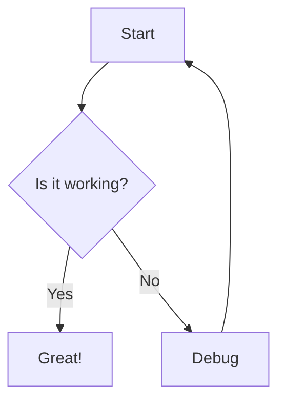
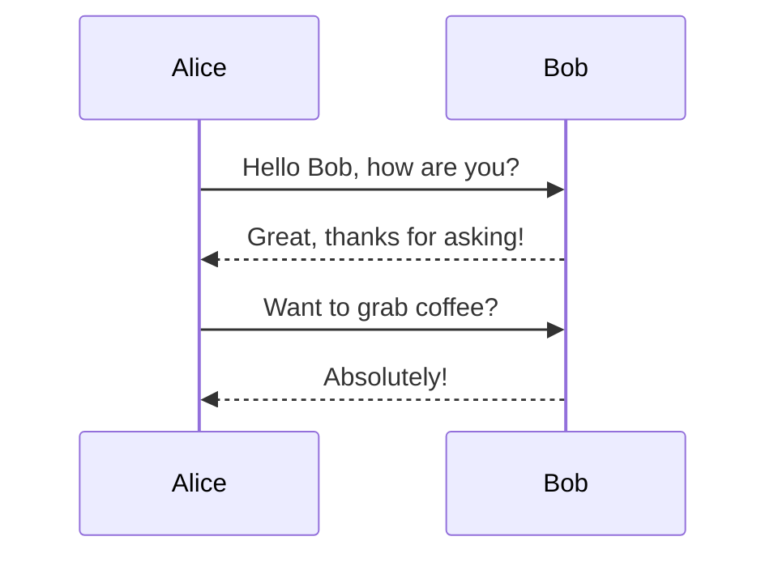
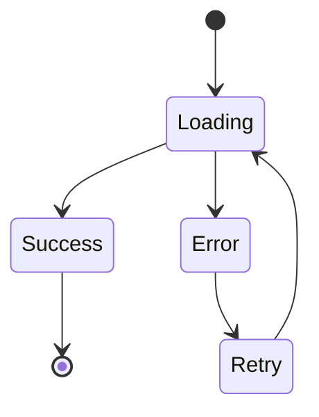

# Mermaid Performance Test

This document contains various mermaid diagrams to test the performance optimizations.

## Simple Flowchart

## Sequence Diagram

## State Diagram

This should render much faster now with:
- Local mermaid.js bundle (no CDN delays)
- Removed artificial timeouts
- Performance config optimizations