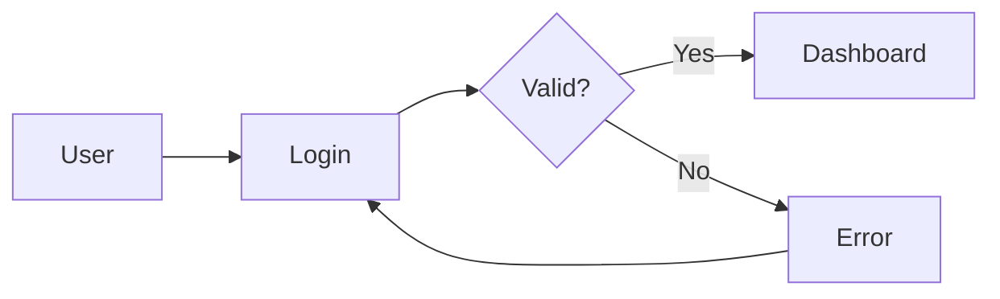
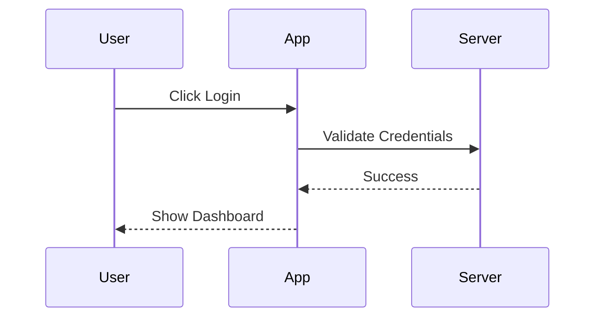
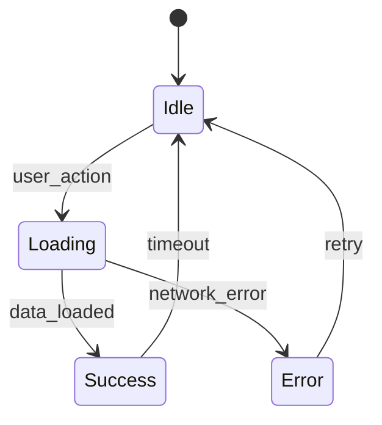
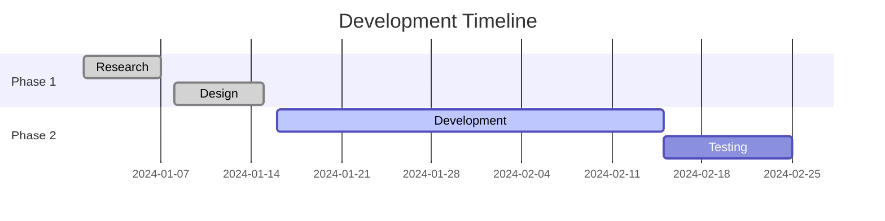
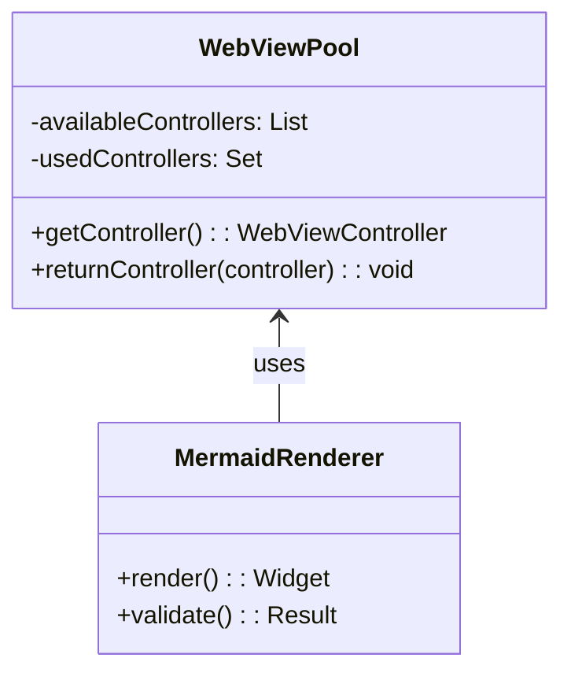

# Phase 2 Performance Test - Multiple Mermaid Charts

This document tests WebView pooling with multiple charts that should render much faster with reused WebView instances.

## Chart 1: Simple Flowchart

## Chart 2: Sequence Diagram

## Chart 3: State Diagram

## Chart 4: Gantt Chart

## Chart 5: Class Diagram

**Expected Performance with Phase 2:**
- First chart: ~500ms (pool initialization)  
- Subsequent charts: ~100-200ms (reused WebView)
- Memory usage: ~150MB total vs ~500MB+ without pooling
- Global mermaid initialization happens only once