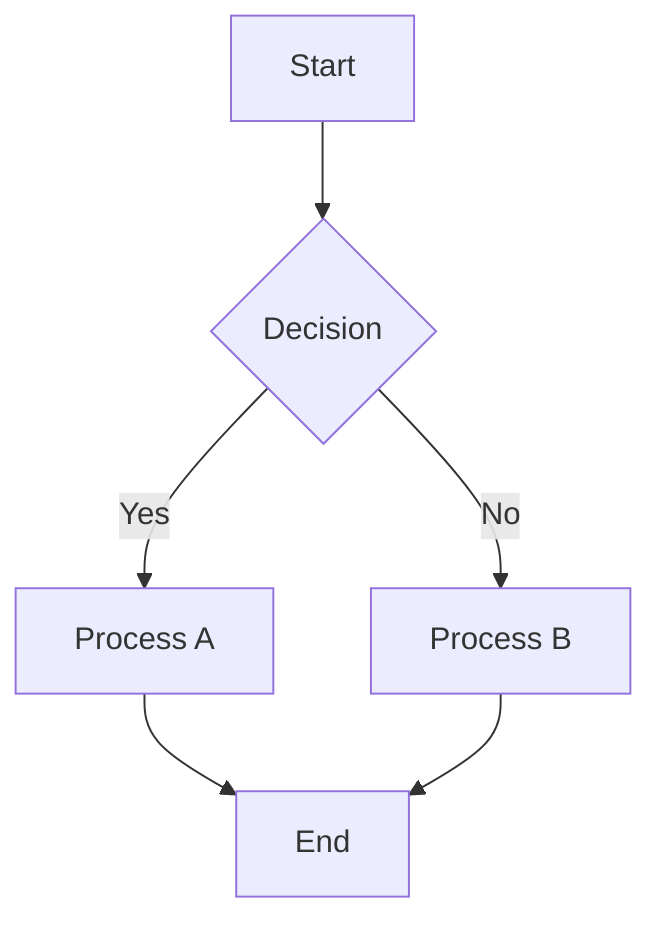

# Chart Test Document

This document tests various chart types to verify the rendering fixes.

## Mermaid Flowchart



## Statistical Bar Chart

```chart
type: bar
title: Sample Data
data:
- Category A: 25
- Category B: 40
- Category C: 30
- Category D: 15
```

## Simple Line Chart

```chart
type: line
title: Growth Over Time
data:
1, 10
2, 15
3, 12
4, 18
5, 22
```

## Pie Chart

```chart
type: pie
title: Resource Distribution
data:
- Development: 45
- Testing: 25
- Documentation: 20
- Management: 10
```